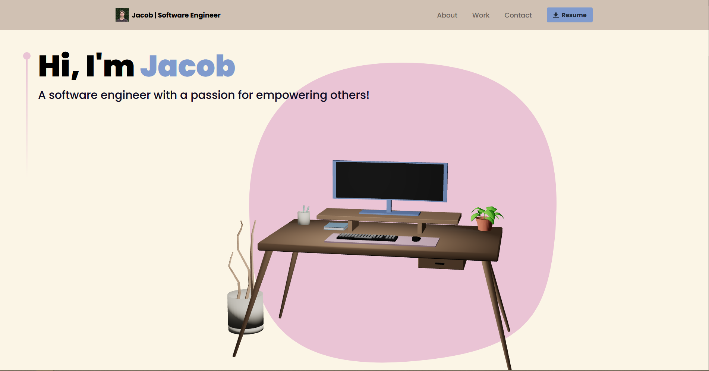

# Jacob's Portfolio - Powered by ThreeJS and React!

Immerse yourself in stunning 3D visuals and interactive experiences with my React and Three.js portfolio app! Made with custom blender models!

## Demo

https://jacobmutton.tech

#### Featured Projects

---

[Parcade - A Parking Service Application](https://github.com/jmutton2/parcade)

[Trailblazer - A Pathfinding Algorithm Simulator](https://github.com/jmutton2/trailblazer)

[Shoppe - Design to Implementation Practice](https://github.com/jmutton2/shoppe)

Hearing Aid Calibration App

## Screenshots



## Run Locally

Clone the project

```bash
  git clone https://github.com/jmutton2/3d_portfolio
```

Go to the project directory

```bash
  cd 3d_portfolio
```

Install dependencies

```bash
  npm install
```

Start the app

```bash
  npm run start
```
